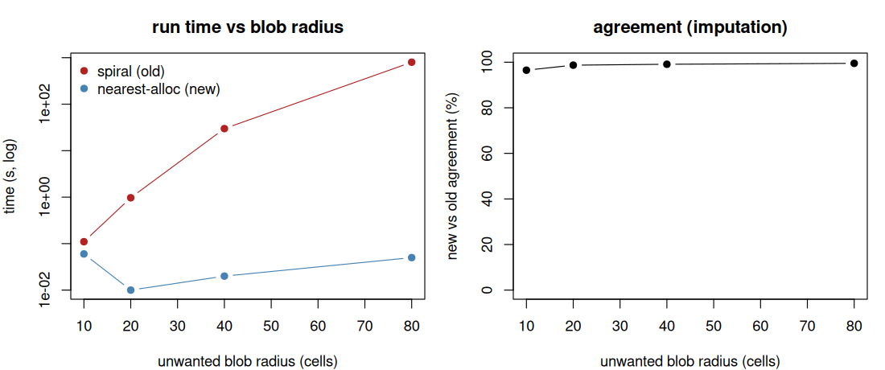
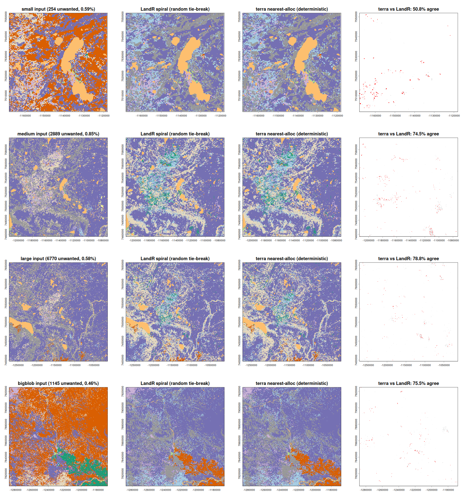
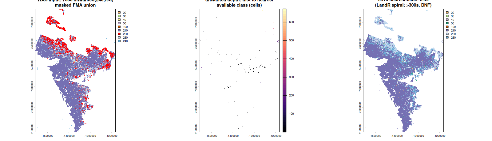

# `convertUnwantedLCC()`: nearest-available allocation

Supporting evidence for replacing the iterative-`spread2()` search in
`convertUnwantedLCC()` with a vectorized `terra::distance()` nearest-available
allocation.

## Why

The previous implementation looped, each pass re-spreading outward from *all*
remaining unwanted pixels with an ever-increasing `iterations` radius. Its cost
therefore grew with the **square of the radius of the largest contiguous block** of
`classesToReplace` — not with raster size. On a study area where such a block is far
from any valid replacement (e.g. a large lake/burn, or an irregular masked boundary
where the nearest available class is tens of km away), the loop needs hundreds of
ever-slower passes and can run for **hours or never finish**. Its `repeatsOnSameUnwanted > 5`
escape hatch only fires when the remaining count is *exactly* unchanged for six passes,
so a slowly-draining tail never triggers it.

The new code computes, for each candidate land-cover class, the distance from every
pixel to the nearest cell of that class with a single vectorized `terra::distance()`;
each unwanted pixel then takes the closest class whose implied `initialEcoregionCode`
is available for its ecoregion (and all of its `speciesCode`s). This is `O(nClasses)`
distance transforms — independent of blob geometry — and **deterministic** (the old
tie-break among nearest cells was random, so the old output was not reproducible).
Per-ecoregion availability constraints are preserved exactly.

## Scaling: run time vs blob radius (self-contained)

`01_scaling_benchmark.R` builds a synthetic landscape with a single unwanted blob of
increasing radius and times both implementations in the same process (it embeds the old
"spiral" for comparison). Run against this branch with
`LANDR_SRC=. Rscript 01_scaling_benchmark.R`.

| blob radius (cells) | unwanted | spiral (old) | nearest-alloc (new) | speedup | agreement |
|---:|---:|---:|---:|---:|---:|
| 10 |    316 |   0.11 s | 0.06 s |      2× | 96.5% |
| 20 |  1,264 |   0.97 s | 0.01 s |     70× | 98.7% |
| 40 |  5,024 |  29.82 s | 0.02 s |  1,356× | 99.1% |
| 80 | 20,108 | 799.82 s | 0.05 s | 15,091× | 99.5% |

The old cost climbs faster-than-quadratically with blob radius (the spread radius grows
every pass) while the new cost stays flat; agreement *rises* with blob size because larger
blobs have clearer nearest answers (fewer ties). The residual disagreement is the old
random tie-break — see below.

## Real LandWeb landscapes: output is within the old algorithm's own variance

`fig2_real_landscapes.png` / `real_landscapes_table.csv` — four real SCANFI+FAO
landscapes (class 240 = FAO-forest pixels that are not a forest LCC class). Because the
old tie-break is **random**, two old runs (different seeds) already disagree on tie
pixels; the new (deterministic) result agrees with the old *as closely as the old agrees
with itself*:

| landscape | ncell | unwanted | terra (s) | LandR (s) | LandR-vs-LandR | terra-vs-LandR |
|---|---:|---:|---:|---:|---:|---:|
| small   |    43,681 |   254 | 0.15 | 0.1 | 52.8% | 50.8% |
| medium  |   341,056 | 2,889 | 0.31 | 0.3 | 74.5% | **74.5%** |
| large   | 1,175,056 | 6,770 | 1.01 | 0.9 | 79.5% | 78.8% |
| bigblob |   250,000 | 1,145 | 0.15 | 0.2 | 72.7% | 75.5% |

On these landscapes the unwanted pixels are *scattered* (shallow), so the old loop is
already fast — confirming the cost is driven by blob radius, not raster size.

## The pathological case: a real masked study area

`fig3_wau_blowup.png` / `wau_table.csv` — the real Western-Alberta-Upland study area
(a 3.77 M-cell raster masked to an irregular 10-tenure union, so the nearest available
class for interior pixels can be very far). The distance from each unwanted pixel to the
nearest available class has median 1 cell but a **maximum of 739 cells** (~177 km):

| study area | ncell | unwanted | max depth (cells) | terra | spiral |
|---|---:|---:|---:|---:|---|
| Western Alberta Upland | 3,770,928 | 7,586 | 739 | **3.5 s** | **did not finish** (300 s cap cleared only 84%, per-pass time growing 0.3 → 16.4 s; a full production run took **>2.8 h and never finished**) |

## Equivalence & tests

- `02_equivalence_vs_original.R` — runs the installed (old) and edited (new)
  `convertUnwantedLCC()` on an **unconstrained** and a **constrained** (per-ecoregion
  availability) case. New-vs-old = 97.8% unconstrained (vs old-self 97.9%) and **100%**
  constrained, with identical assignment distributions and no unavailable
  `ecoregionGroup` ever produced.
- A regression test lives in `tests/testthat/test-cohorts.R`
  (`"convertUnwantedLCC replaces unwanted classes with nearest available class"`):
  resolves all unwanted pixels, never emits a `classesToReplace` code, deterministic,
  and respects per-ecoregion availability.

The `fig2`/`fig3` scripts require LandWeb's SCANFI + FAO input rasters (private data), so
they are not included here; their outputs (figures + tables) are.
