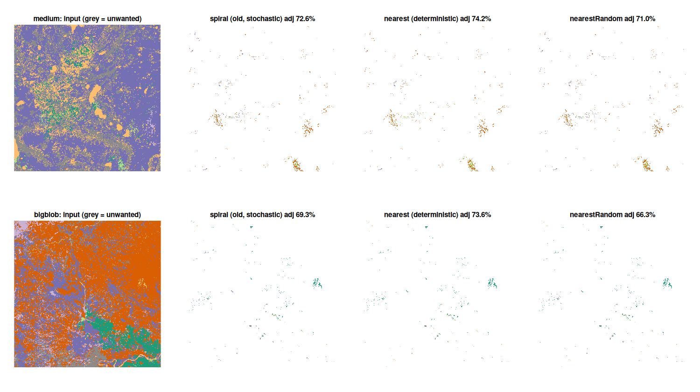
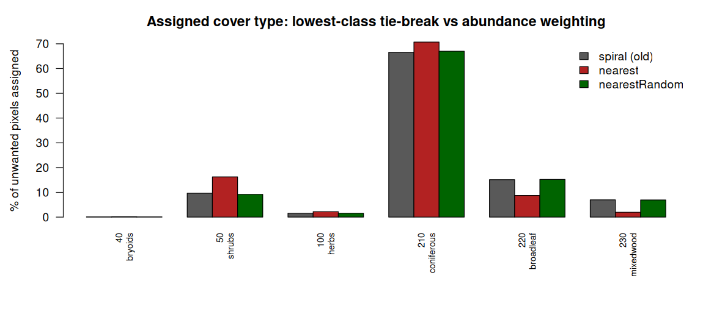
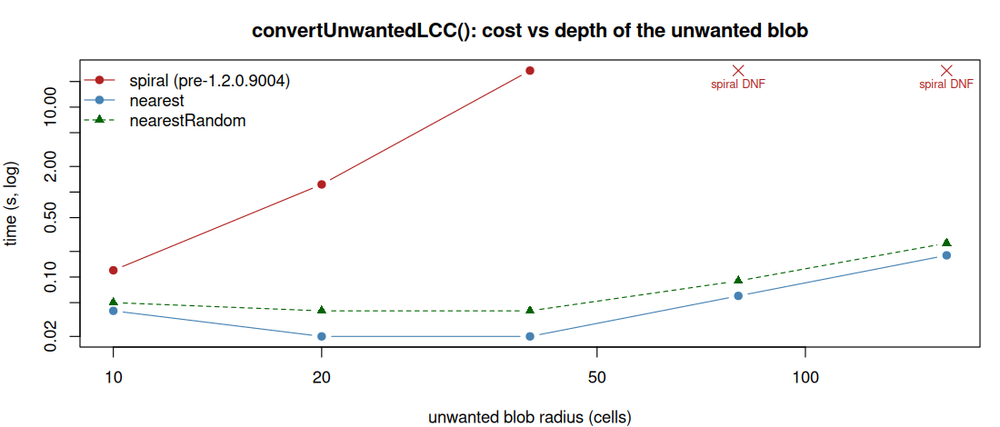

# `convertUnwantedLCC(method = "nearestRandom")`

Supporting evidence for adding a `method` argument to `convertUnwantedLCC()`, restoring a
*stochastic* allocation alongside the deterministic nearest-available allocation that
replaced the `spread2()` search in 1.2.0.9004.

## Why

1.2.0.9004 made `convertUnwantedLCC()` deterministic: each unwanted pixel takes the nearest
available class, ties breaking to the lowest class. That fixed a real blow-up (the previous
`spread2()` search cost grew with the square of the blob radius and could run for hours
without finishing) but it also changed *what gets imputed*. The previous implementation
sampled among all valid cells within the radius at which it first found one, so a class was
picked in proportion to how much of it was nearby. Taking only the nearest class instead
systematically over-assigns whichever class happens to touch the blob edge first, and — via
the lowest-class tie-break — the lower-numbered classes.

That is visible below: on the `large` landscape the old algorithm assigned class 230 to 6.0%
of unwanted pixels, `method = "nearest"` assigns it 1.6%, and class 50 goes the other way,
8.2% → 14.6%. `method = "nearestRandom"` restores the old proportions (5.9% and 7.9%) while
keeping the new cost profile.

`"nearestRandom"` samples one of the pixel's available classes weighted by how many cells of
each the neighbourhood holds, where the neighbourhood is the smallest window reaching that
pixel's nearest available class — the window at which `spread2()` would have stopped. The
window is rectangular because `spread2(directions = 8)`'s was too. Counts come from a
summed-area table, so a window 1500 cells across costs the same as one 3 cells across.

## Real landscapes: does `nearestRandom` put the same mix on the ground?

`03_method_comparison.R` / `real_landscapes_methods.csv`. The same four real SCANFI + FAO
landscapes as the 1.2.0.9004 benchmark bundle (class 240 = FAO-forest pixels that are not a
forest LCC class). Each stochastic method is run under three seeds; the old algorithm's own
seed-to-seed values are the **noise floor** every other column must be read against.

Two things are measured, and only the second one discriminates:

* **per-pixel agreement** with the old algorithm. This cannot separate the methods, because
  the old algorithm was itself random — it does not even agree with itself (53.9–79.2%).
* **assigned-class composition**, summarised as total-variation distance from the old
  algorithm's mix (0 = identical mix, 1 = disjoint). This is what changed in 1.2.0.9004.

| landscape | ncell | unwanted | spiral (s) | nearest (s) | nearestRandom (s) | agree: spiral self | nearest | nearestRandom | **TVD: spiral self** | **nearest** | **nearestRandom** |
|---|---:|---:|---:|---:|---:|---:|---:|---:|---:|---:|---:|
| small   |    43,681 |   254 | 0.07 | 0.07 | 0.11 | 53.9% | 52.5% | 53.8% | 0.0486 | 0.2953 | **0.0157** |
| medium  |   341,056 | 2,889 | 0.11 | 0.22 | 0.40 | 74.6% | 74.6% | 73.2% | 0.0072 | 0.1155 | **0.0098** |
| large   | 1,175,056 | 6,770 | 0.61 | 0.97 | 1.30 | 79.2% | 78.7% | 78.4% | 0.0043 | 0.1008 | **0.0042** |
| bigblob |   250,000 | 1,145 | 0.07 | 0.16 | 0.28 | 73.6% | 75.5% | 72.2% | 0.0207 | 0.1456 | **0.0041** |

Per-pixel agreement is the same for both new methods and sits at the old algorithm's own
self-agreement — as it must; that column is saturated by tie-break noise. The composition
column is the one to read: `nearest` sits **6–23×** further from the old mix than the old
algorithm's own seed-to-seed variation, while `nearestRandom` sits below that noise floor on
three of the four landscapes and within 1.4× of it on the fourth (`medium`, 0.0098 vs
0.0072) — i.e. indistinguishable from re-running the old algorithm with a new seed.

### The composition itself (`assigned_class_composition.csv`)

Proportion of unwanted pixels assigned to each class, `large` landscape:

| class | spiral (old) | nearest | nearestRandom |
|---|---:|---:|---:|
| 40  | 0.0007 | 0.0012 | 0.0004 |
| 50  | 0.0823 | **0.1458** | 0.0794 |
| 100 | 0.0069 | 0.0112 | 0.0066 |
| 210 | 0.7165 | 0.7490 | 0.7206 |
| 220 | 0.1336 | **0.0765** | 0.1337 |
| 230 | 0.0600 | **0.0162** | 0.0593 |

`nearest` roughly halves 220 and quarters 230 while inflating 50; `nearestRandom` tracks the
old algorithm to within a few parts in ten thousand.

## Where the bias actually lives: the tie-break, not a direction

[PR #196 raised](https://github.com/PredictiveEcology/LandR/pull/196#issuecomment-5184524397)
that the function was made stochastic in the first place because a deterministic pick left a
visible artifact — the recollection being that it "always chose the north east (or whatever)
replacement". Worth pinning down which artifact this implementation actually has, since the
two call for different fixes.

It is **not directional**. `method = "nearest"` picks the class whose nearest cell is
closest; only when two or more classes *tie* at that distance does the tie-break decide —
and it always resolves to the lowest class code. `05_bias_diagnostics.R` measures both
possibilities:

| landscape | unwanted pixels with a tie | share given the lowest tied class — spiral | **nearest** | nearestRandom | adjacency — spiral | nearest | nearestRandom |
|---|---:|---:|---:|---:|---:|---:|---:|
| medium  | 34.9% | 45.0% | **100.0%** | 46.1% | 72.6% | 74.2% | 71.0% |
| bigblob | 40.6% | 52.7% | **100.0%** | 47.5% | 69.3% | 73.6% | 66.3% |

Ties are common — a third to two fifths of all unwanted pixels — and `nearest` resolves
**every one** of them to the lowest class code, where the old algorithm and `nearestRandom`
take it roughly half the time. That is the whole of the composition shift in the previous
section: a systematic pull toward low-numbered classes, applied at ~40% of pixels.

Spatial structure, by contrast, barely moves (adjacency agreement among neighbouring
unwanted pixels, 72.6% → 74.2%), so there is no directional or patch artifact to fix here —
the concern is real, but its mechanism in this implementation is the class-code tie-break.



### What that costs in cover-type terms

"Lowest code wins" is not a neutral rule. The Canada LCC class codes
([`LandR::prepInputs_NTEMS_LCC_FAO()`](../../R/prepInputs_NTEMS.R)) run roughly
non-vegetated → non-forest vegetation → forest, and within forest coniferous (210) <
broadleaf (220) < mixedwood (230). So a tie-break to the lowest code systematically prefers
sparse cover over forest, and coniferous over the deciduous-bearing classes.

Pooled over the four landscapes, weighted by unwanted pixels (`06_class_bias_by_cover_type.R`
/ `class_bias_by_cover_type.csv`); values are % of all unwanted pixels:

| class | cover type | spiral (old) | nearest | nearestRandom | nearest ÷ old | nearestRandom ÷ old |
|---:|---|---:|---:|---:|---:|---:|
|  40 | bryoids    |  0.10 |  0.16 |  0.09 | 1.61× | 0.97× |
|  50 | shrubs     |  9.63 | **16.25** |  9.20 | **1.69×** | 0.96× |
| 100 | herbs      |  1.60 |  2.20 |  1.57 | 1.37× | 0.98× |
| 210 | coniferous | 66.59 | 70.70 | 67.00 | 1.06× | 1.01× |
| 220 | broadleaf  | 15.12 | **8.75** | 15.21 | **0.58×** | 1.01× |
| 230 | mixedwood  |  6.97 | **1.96** |  6.93 | **0.28×** | 0.99× |

| cover group | spiral (old) | nearest | nearestRandom |
|---|---:|---:|---:|
| non-forest vegetation | 11.33 | **18.61** (1.64×) | 10.86 (0.96×) |
| forest                | 88.68 | **81.41** (0.92×) | 89.14 (1.01×) |

So the deterministic rule **inflates shrubs by 69%** (+6.6 percentage points of all unwanted
pixels) and thins **broadleaf by 42%** (−6.4 pp) and **mixedwood by 72%** (−5.0 pp), while
nudging coniferous up 6% (+4.1 pp). Roughly one in fourteen pixels that the old algorithm
would have made forest becomes non-forest vegetation instead.

For a succession model this is not cosmetic: a pixel imputed as shrubs or herbs carries no
tree cohorts at all, and broadleaf/mixedwood → coniferous shifts the deciduous fraction that
drives `partitionBiomass()` and the fire regime. `nearestRandom` lands within 0.96–1.01× of
the old algorithm on every cover type.



## Cost: does restoring the randomness restore the blow-up?

`04_scaling_all_methods.R` / `scaling_all_methods.csv` — self-contained (no private data): a
single unwanted blob of increasing radius, timed under all three methods. This is the sweep
that motivated 1.2.0.9004, rerun with the new method added.

| blob radius (cells) | ncell | unwanted | spiral (old) | nearest | nearestRandom | speedup vs spiral |
|---:|---:|---:|---:|---:|---:|---:|
|  10 |     676 |    316 |   0.12 s | 0.04 s | 0.05 s |     2× |
|  20 |   2,704 |  1,264 |   1.23 s | 0.02 s | 0.04 s |    32× |
|  40 |  10,816 |  5,024 |  26.89 s | 0.02 s | 0.04 s |   727× |
|  80 |  43,264 | 20,108 | **DNF** (>120 s cap; 9,980 pixels still unresolved) | 0.06 s | 0.09 s | — |
| 160 | 173,056 | 80,452 | **DNF** (>120 s cap; 68,052 pixels still unresolved) | 0.18 s | 0.25 s | — |



`nearestRandom` costs roughly 1.3–2× `nearest` — it adds a second set of distance transforms
(to size the window in cells, independent of CRS and resolution) and one summed-area table
per candidate class, all O(ncell) and all independent of blob depth. It stays flat exactly
where the old implementation diverges.

## Tests

`tests/testthat/test-cohorts.R`:

* `"...samples by local abundance"` — a single unwanted pixel whose 8 neighbours are one
  210 (the strictly nearest) and seven 220. `"nearest"` must always return 210;
  `"nearestRandom"` must return it ~1 time in 8 — i.e. weighted by neighbourhood
  composition, neither by proximity alone nor uniformly over the classes.
* `"...is seed-reproducible and constrained"` — identical under a repeated seed, different
  under a new one, still resolves every unwanted pixel, and still never emits an
  ecoregion-class combination absent from `availableERC_by_Sp`.
* `"...methods agree when only one class can be chosen"` — with no choice to make, the two
  methods must return the same thing.

## Reproducing

The four real landscapes and the WAU study area are private LandWeb data; the synthetic
sweep is self-contained.

```sh
LANDR_SRC=. Rscript benchmarks/convertUnwantedLCC-nearestRandom/04_scaling_all_methods.R
LCC_BENCH_DIR=<dir with v2_input_*.tif> LANDR_SRC=. \
  Rscript benchmarks/convertUnwantedLCC-nearestRandom/03_method_comparison.R
LCC_BENCH_DIR=<dir with v2_input_*.tif> LANDR_SRC=. \
  Rscript benchmarks/convertUnwantedLCC-nearestRandom/05_bias_diagnostics.R
LANDR_SRC=. Rscript benchmarks/convertUnwantedLCC-nearestRandom/06_class_bias_by_cover_type.R
```
